# To Do List 

The application i chose to make was a simple to do list running in the python terminal, it will allow the creating of tasks to then complete features can be found below.

# Application Description and Features

## Home

The home feature is a simple menu select space that remains open while the user decides exactly they would like to select (Create user, Login to existing user, view the help and controls txt file or exit the application entirely)

### Specific features:

1. Login.
2. Signup (create user).
3. Help and controls.
4. Exit.

## Create User/Login User

The create feature allows the user to create a unique user that will be saved to a database that holds all user created. Following that the user created since its saved will now be accessible via logging in. These features allow the user information and data entered to be stored for later sessions, for example if you make a task on user1 username to be completed that task will be saved to user1 and only accessible to user1, if a user2 is made they will have their information stored under user2, so on so forth.

### Specific features:

1. Create unique user from username/password inputs.
2. Save username/password made by user to user database.
3. Store any information made within the application on specific user to unique user created txt file.

## Main Navigation Menu

This area of the application is simply going to be a navigation hub that accepts inputs from the user to enter different areas of the application as entered by the user, eg typing 1 and pressing enter will place the user in the add task function which will then allow them to access the features of that function, below is more information.

### Specific features:
1. Add task (for logged in user)
2. View tasks made (for logged in user)
3. Complete tasks (for logged in user)
4. Delete tasks (for logged in user)
5. Help and controls (Read only txt file for all users)
6. logout to home (for logged in user)

## Add Task

This function will take the information entered by the logged in user write it then store it in that users database.

### Specific features:

1. Task title
2. Task information (the information stored eg title = shopping list. Task info = eggs - milk - etc.)
3. Task priority (High, medium or low importance)
I added this field with the intention of creating a search and filter functionality to sort tasks by importance and date, however i ran out of time. Regardless i left it in as creating the search functionality later is still viable.
4. Task importance is simply adding a ! to a task of "High" priority, once again this was for easy filtering.
5. Task due date will allow the user to input a date that the task needs to be completed by hence the name. however this can be skipped.

## View All Tasks

View all tasks has no true functionality within it as it is simply to view the tasks made and all the info within them. Although it will allow the view task menu to show until the input of 0 exit or enter is input by the logged in user.

## Complete Tasks

Complete tasks will allow the logged in user view completed and non completed tasks as well as complete and un complete tasks within the menu.
Then once again will allow the user to return to main menu.

## Delete Tasks

Delete tasks will allow the user to completely delete a task created through inputs. There is however no way to re create tasks deleted (an archive).

## Help and Controls

A simple txt doc that will show in the terminal when the user decides to show it, the user will not need to login to view this file. 
The file will also not allow writing to it unless of course its modified at a root folder level.

## Logout of Application 

A simple logout function for the user to input to allow them to be taken back to the HOME page to either login/signup or exit the application entirely.

# Github Link

[To-do list Application in Github](https://github.com/Preedie/T1A3_TerminalApp.git)

# Trelloboard

## Implementation:

I used trelloboard to not only track the tasks I needed to complete but also sort them the way I would like to complete them, I did however realise that due to the way I was writing my code and its modularity that the order of tasks was less important once i had the main menu and selectors within the main menu complete as the way it was designed allowed me to add/remove and adjust alot of the programs functionality without "breaking code" so to speak. I did however stick to starting from the top of the doing and then working my way through, with the only deviations from the screen shots being when i went back to patch/change some code already completed as i didn't like the way it functioned logically or of course if i missed something.

Submenus below the main trelloboard show the tasks i had within some of the to-dos.

You may of noticed that there is a cancelled area within my trelloboard, this is because these were additions I would have liked to of added had I of had the time.
The code however is modular enough that if Im to go back and implement them it would be incredibly easy to build their functions and slot them into the main menu.

### Screenshots of progress

# Day 1/3:

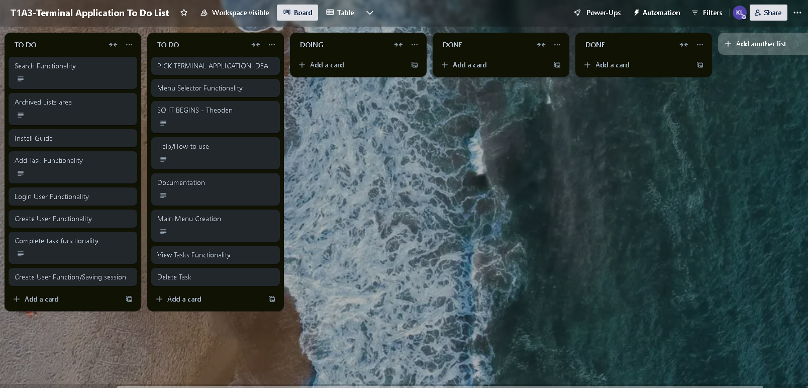

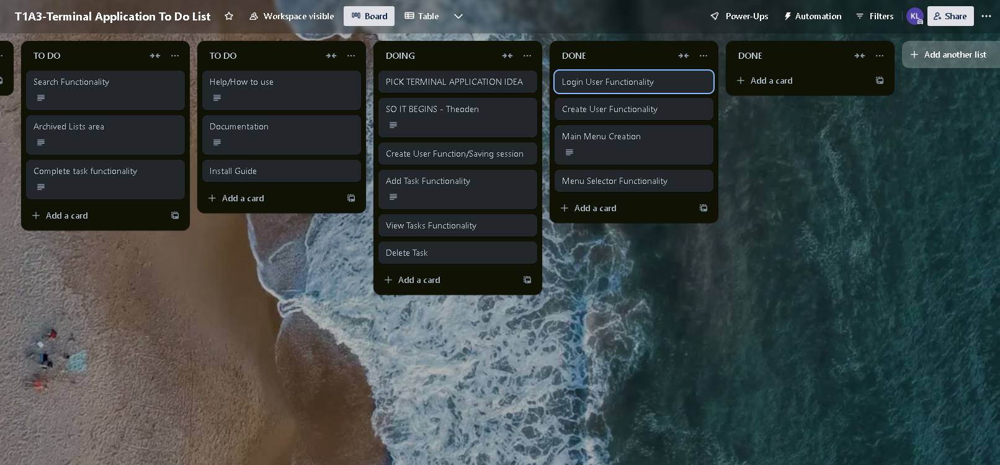

## Day 1/3 Done:

# Day 4/7

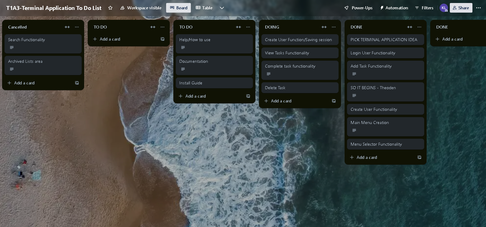

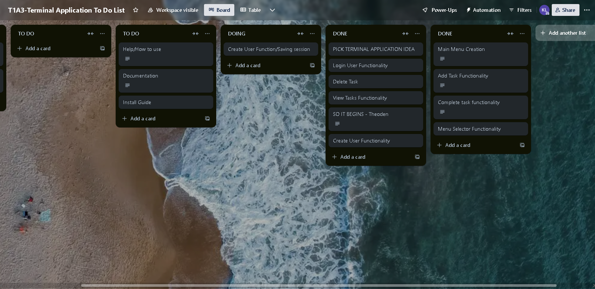

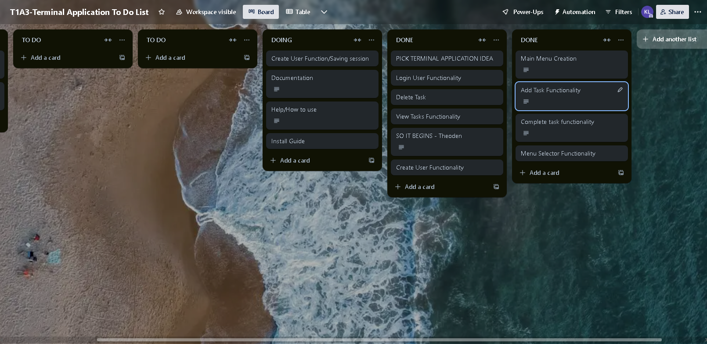

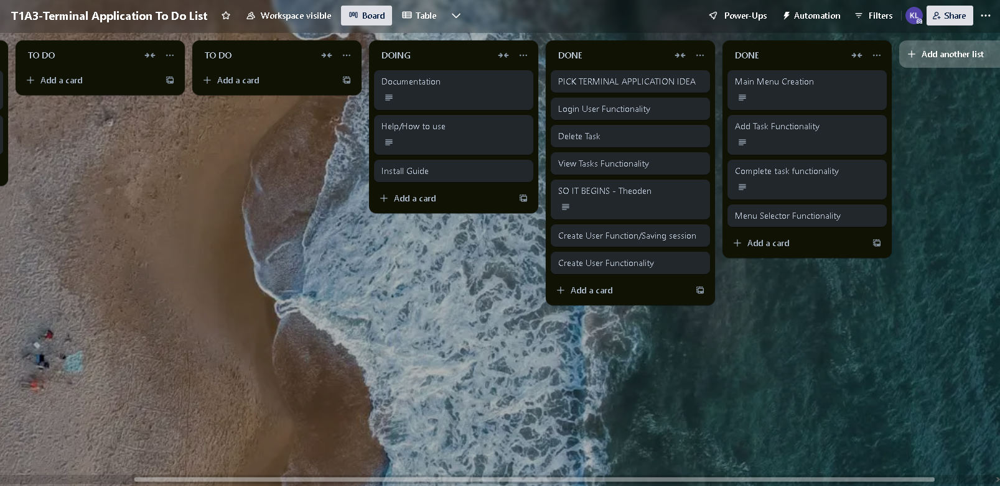

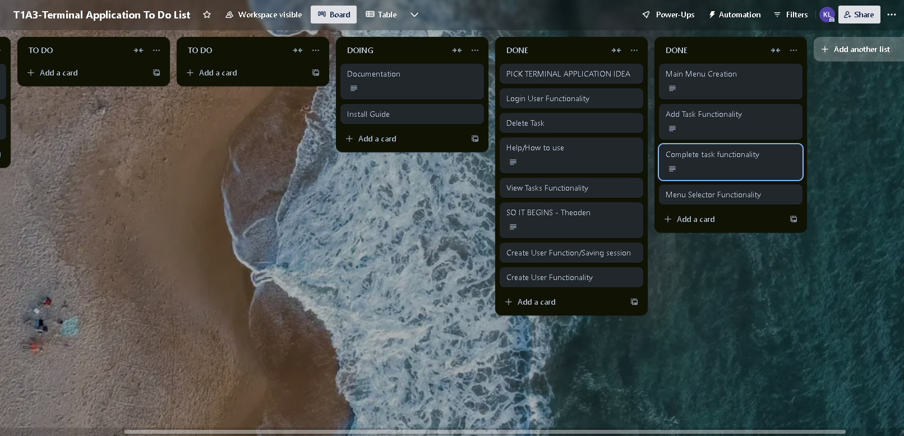 

## Dat 4/7 Done:

# Day 8-9:

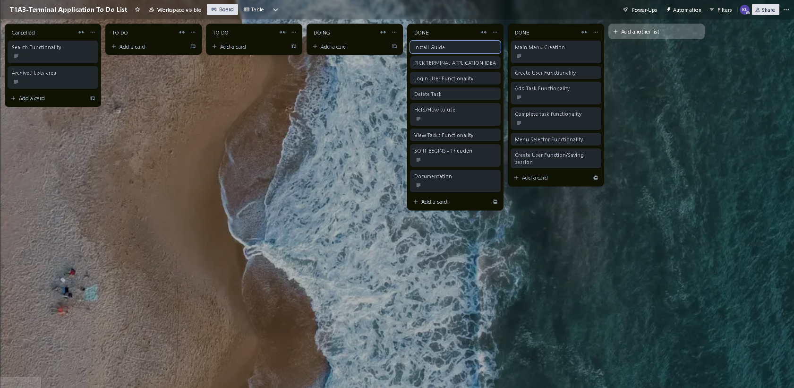

## Day 8-9 done:

# Trello Sub Menu Tasks Days 1-9:

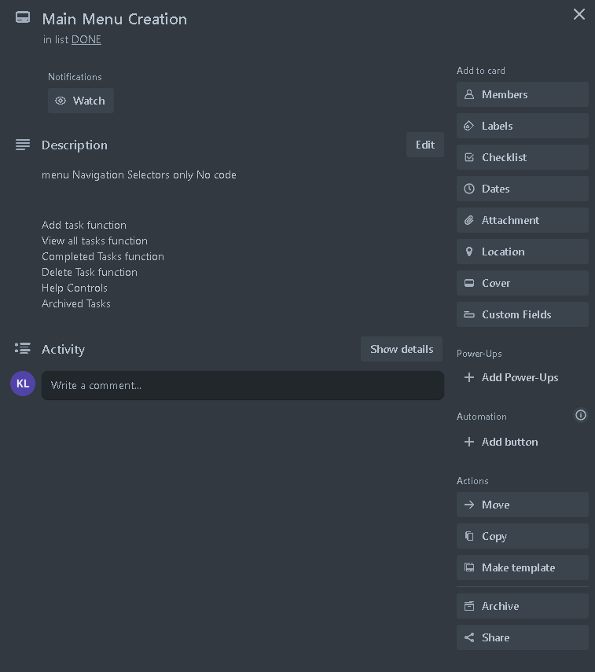

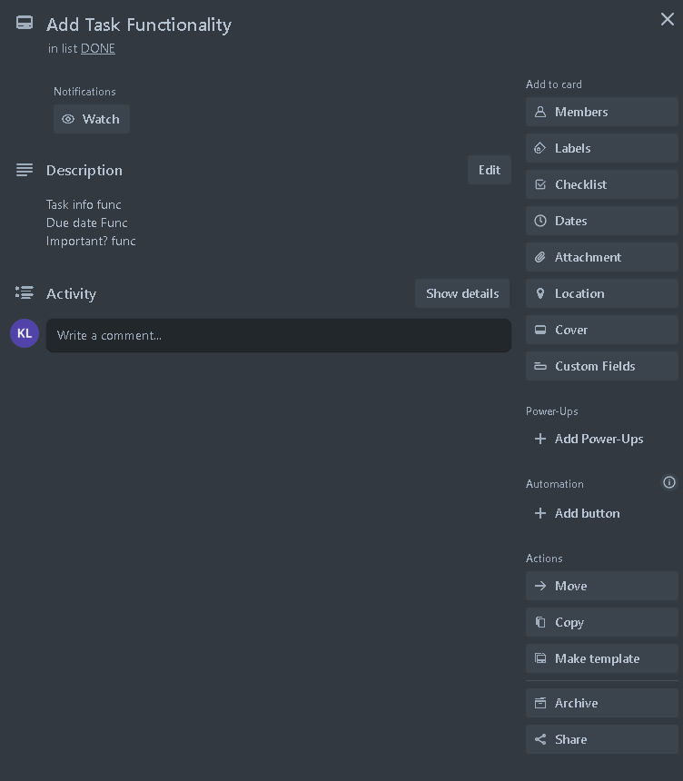

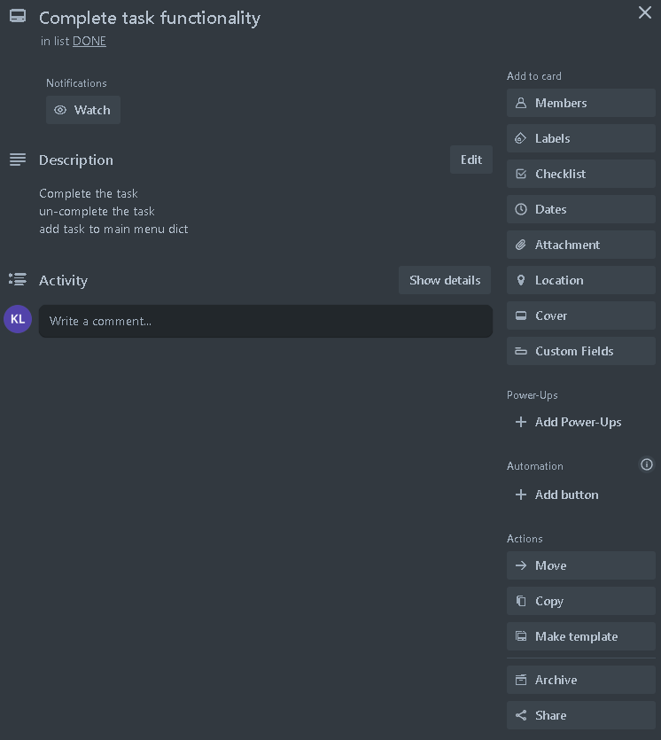

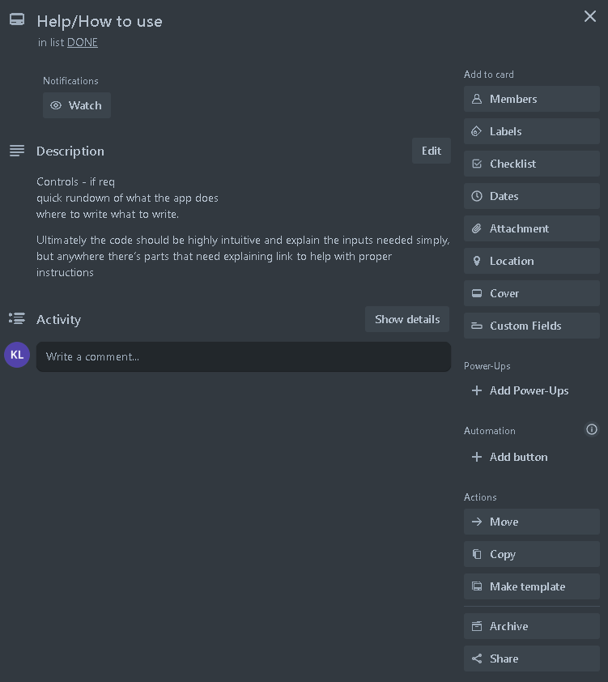

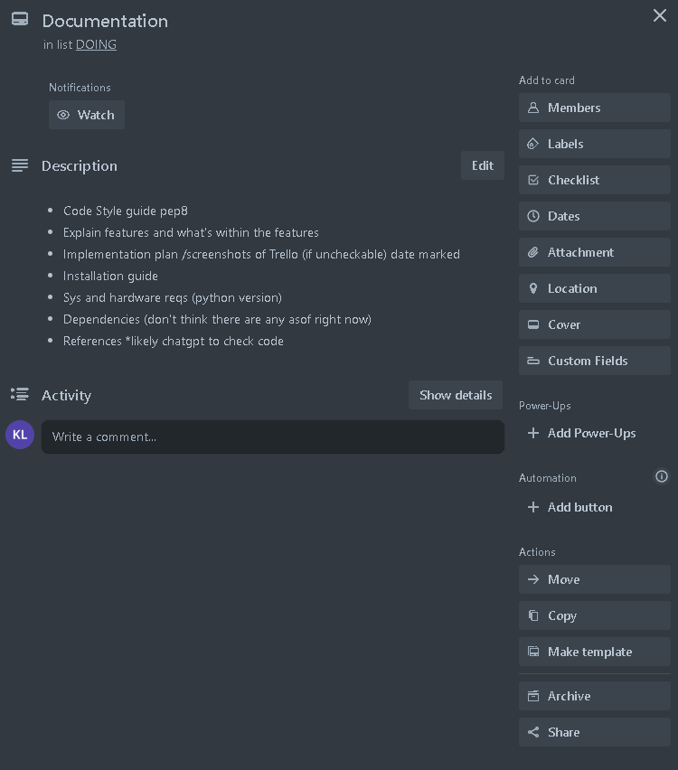

# Installation

- Follow this link to install ubuntu for your operating system!

[Ubuntu Installation Guide](https://ubuntu.com/tutorials/install-ubuntu-desktop#1-overview)

- Check that you are running atleast python 3.10.12 by copying this text into your ubuntu terminal.

~~~
python3 --version
~~~

- If you currently dont have python installed run this command line in your ubuntu terminal. if you have issues go here [Python Install](https://www.python.org/downloads/)

~~~
sudo apt update
sudo apt install python3
~~~

- Next we will install pip copy and paste the code into your ubuntu terminal.
if you have issues go here [PIP Install](https://pypi.org/project/pip/)

~~~
sudo apt update
sudo apt install python3-pip
~~~

1. After running that command line lets check that our pip is up to date, it should read 22.0.2 or a above.

~~~
pip --version
~~~

- Next we will clone the git repository so we can run the application.
1. Go to Github and copy the repositories URL into your ubuntu terminal.

~~~
git clone https://github.com/repousername/repository.git
~~~

- Next navigate to the src folder and once inside the src folder run this command.

~~~
./To_Do_list.sh
~~~

- When you're finished with the application close your ubuntu terminal window, go to search and open your OS cmd prompt.
In this widow put the following.

~~~
wsl --shutdown
~~~

- This will close all virtual enviroments and stop un-used programs from consuming your computers resources pointlessly.

ENJOY!

# Dependencies

- pip
- ubuntu
- python

# System Requirements

## Minimum Requirements

- 1 GHZ Processor
- RAM 2GiB
- Disk 10GiB
- Win 10-11
- Mac OS
- Linux

Running these specs will very likely cause issues to rise regarding speed and possibly even bluescreens, as the virtual enviroment that runs ubuntu when opening programs can devouer upwards of 2gb of RAM, but in theory, with the minimum specs it is entirely possible to run, albiet slowly.

## Recommended Requirements

- 3 GHZ Processor
- 16 GiB RAM
- Disk 500 GiB
- Win 10-11
- Mac OS
- Linux

I recommend nothing less than these specs if you want a smooth experience. If problems are ecnountered with RAM usage I would recommend making a txt file in your %UserProfile% file navigation named .wslconfig within this txt add the following.

~~~
[wsl2]
memory=4GB # Limits VM memory in WSL 2 to 4 GB
processors=2 # Makes the WSL 2 VM use two virtual processors
~~~

This cannot be run in ubuntu, it has to be entered into the command prompt or MAC equivilent.

this specification will stop the virtual enviroment from eating alot of RAM, however if you're experiencing no issues, you won't need to worry about it.

# Styling 

- The styling guide used for writing the code/program was [PEP-8 Styling guide](https://peps.python.org/pep-0008/#introduction).

# References

- Coder Academy ED lessons and live Classes. [Coder Academy Website](https://info.coderacademy.edu.au)

